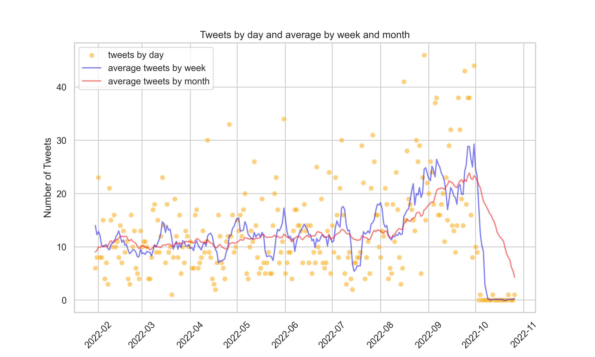

# Twitter Scrape Project

## How to use it

First, clone the project in some folder.
Install the requirements.txt, preferably in a virtual environment.
Activate the virtual environment and run the follow code:
> python app.py

## About

Snscrape is used to access Twitter data, obtaining dates, likes, hashtags, retweets, users, among other information.

The information is transformed into a dataframe and saved.

From this information, several analyzes are possible: from the frequency of interactions to the engagement of each post, from the reach to the impact of the message.

In this sense, we extracted the tweets of the candidate for the presidency of Brazil in the 2022 elections, Ciro Gomes, who ended the first round of the election in fourth position.

The target time interval was from 01/01/2022 to 10/30/2022 (date of the end of the second round of the election for President of the Republic).

----------------

To Improve:
* Automate and create visualization options.
* Automate outlier detection.
